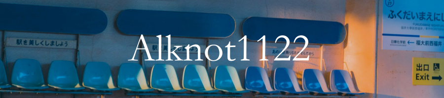

---

### Hi there 👋, **my name is KLA**

<h3 align="center">A Computer Engineering Student from Chulalongkorn University, Thailand 🇹🇭</h3>

 

 🌱 I’m currently learning **Automated Testing and Software Develop**

 

 

 
<h3 align="center">⚒️ Languages-Frameworks-Tools ⚒️</h3>
 

                
      
      

---

 

**Feel free to contact me**

 
  
  
  <a href="https://github.com/Alknot1122/AboutME" target="_blank">
      <!-- sqlite, safari, google-chrome are other good icon options -->
  </a>
